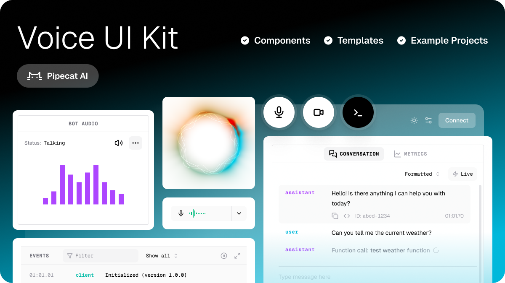

# Pipecat Voice UI Kit





Components, hooks and template apps for building React voice AI applications quickly. Designed to support and accelerate [Pipecat AI](https://github.com/pipecat-ai/pipecat) development.

- 🔬 **Debug console** – Flexible, modular console UI to test and benchmark your Pipecat apps

- 🔌 **Headless components** – Construct your own UIs with building blocks for voice, video, and real-time AI interactions

- 🚀 **Drop-in templates** – Fully-featured, configurable UIs for developing and showcasing Pipecat apps

- 💅 **Fully customizable** – Built on Tailwind 4 and styled with CSS variables. Extend the built-in theme or bring your own

- 📱 **Responsive design** – Optimized for desktop, tablet, and mobile devices

- ⭐ **Example apps** – Real-world implementations demonstrating best practices

## Quickstart

### Install the library

```shell
npm i @pipecat-ai/voice-ui-kit @pipecat-ai/client-js @pipecat-ai/client-react
```

_You will also have to install one of the supported transport packages_

```shell
npm i @pipecat-ai/daily-transport
# or
npm i @pipecat-ai/small-webrtc-transport
```

_Optional - install recommended fonts for default theme_:

```shell
npm i @fontsource-variable/geist @fontsource-variable/geist-mono
```

### Use the console template to chat with a Pipecat Bot:

```typescript
// Optional: recommended fonts
import "@fontsource-variable/geist";
import "@fontsource-variable/geist-mono";

// Styles
import "@pipecat-ai/voice-ui-kit/styles.css";

import { ConsoleTemplate, ThemeProvider } from "@pipecat-ai/voice-ui-kit";

// Render Console template in full screen container
export default function App() {
  return (
    <ThemeProvider>
      <div className="w-full h-dvh bg-background">
        <ConsoleTemplate
          onConnect={ async () => {
            // ... bot connect logic here
          }}
        />
      </div>
    </ThemeProvider>
  );
}
```

_Need a Pipecat agent to play with quickly? Check out this example and deploy in seconds to Pipecat Cloud!_

## What's included?

- How it's built, dependencies used etc

### Key dependencies

- Tailwind

- Shadcn & Radix

### How to use it

- Components
  - How to use, link to docs

- Elements
  - How to use, link to docs

- Voice visualizers
  - How to use, link to docs
  - Using WebGL visualizers

- Templates
  - How to use, link to docs

  - Figma file (coming soon)

## Styling and themeing

- Use with or without styles

- Customizing the included theme
  - shadcn variables list
  - TW4 variables list
  - changing the icon liberary

- Scoping to avoid conflicts
- working with TW3

## Example projects

- Links out

## Working with the framework

### Extending with your own components

- Ladle / component stories
