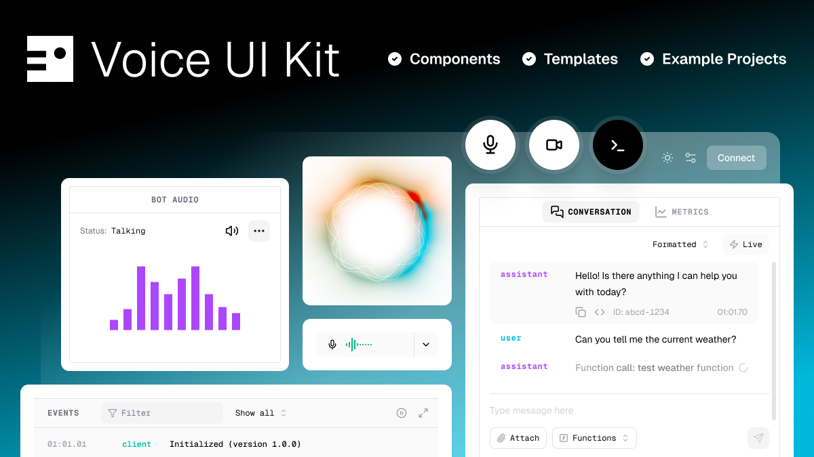

# Pipecat Voice UI Kit

[](https://docs.pipecat.ai/client/introduction)




Components, hooks and template apps for building React voice AI applications quickly. Designed to support and accelerate [Pipecat AI](https://github.com/pipecat-ai/pipecat) development.

- 🔬 **Debug console** – Flexible, modular console UI to test and benchmark your Pipecat apps

- 🔌 **Components** – Construct your own UIs with building blocks for voice, video, and real-time AI interactions

- 🚀 **Drop-in templates** – Fully-featured, configurable UIs for developing and showcasing Pipecat apps

- 💅 **Fully customizable** – Built on Tailwind 4 and styled with CSS variables. Extend the built-in theme or bring your own

- 📱 **Responsive design** – Optimized for desktop, tablet, and mobile devices

- ⭐ **Example apps** – Real-world implementations demonstrating best practices


## Quickstart

### Install the library

```shell
npm i @pipecat-ai/voice-ui-kit @pipecat-ai/client-js @pipecat-ai/client-react
```

_You will also have to install one of the supported transport packages_

```shell
npm i @pipecat-ai/daily-transport
# or
npm i @pipecat-ai/small-webrtc-transport
```

_Optional - install recommended fonts for default theme_:

```shell
npm i @fontsource-variable/geist @fontsource-variable/geist-mono
```

# Launch and browse the Storybook:

```bash
npm run dev
```

### Use the console template to chat with a Pipecat Bot:

```typescript
// Optional: recommended fonts
import "@fontsource-variable/geist";
import "@fontsource-variable/geist-mono";

// Styles
import "@pipecat-ai/voice-ui-kit/styles";

import { ConsoleTemplate, ThemeProvider } from "@pipecat-ai/voice-ui-kit";

// Render Console template in full screen container
export default function App() {
  return (
    <ThemeProvider>
      <div className="w-full h-dvh bg-background">
        <ConsoleTemplate
          transportType="smallwebrtc"
          connectParams={{
            webrtcUrl: "/api/offer",
          }}
        />
      </div>
    </ThemeProvider>
  );
}
```

## Build a custom UI

```tsx
import {
  ConnectButton,
  ControlBar,
  ErrorCard,
  FullScreenContainer,
  PipecatAppBase,
  SpinLoader,
  VoiceVisualizer,
  UserAudioControl
  type PipecatBaseChildProps,
} from "@pipecat-ai/voice-ui-kit";

export default function Home() {
  return (
    <FullScreenContainer>
      <PipecatAppBase
        transportType="smallwebrtc"
        connectParams={{
          webrtcUrl: "/api/offer",
        }}
      >
        {({
          client:
          handleConnect,
          handleDisconnect,
          error,
        }: PipecatBaseChildProps) =>
          loading ? (
            <SpinLoader />
          ) : error ? (
            <ErrorCard error={error} />
          ) : (
            <>
              <VoiceVisualizer participantType="bot" />
              <ControlBar>
                <UserAudioControl />
                <ConnectButton
                  onConnect={handleConnect}
                  onDisconnect={handleDisconnect} />
              </ControlBar>
            </>
          )
        }
      </PipecatAppBase>
    </FullScreenContainer>
  );
}
```

## Examples and Docs

📓 [Documentation](https://voiceuikit.pipecat.ai)

Examples:

- [Console Template](./examples/01-console/)
- [Custom UI with components](./examples/02-components/)
- [Pipcat Base App](./examples/03-pipecat-base-app/)
- [Vite](./examples/04-vite/)